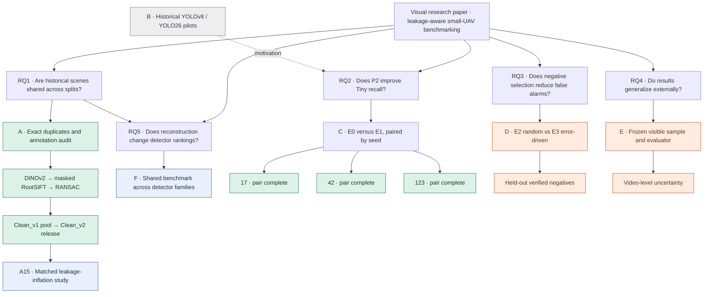
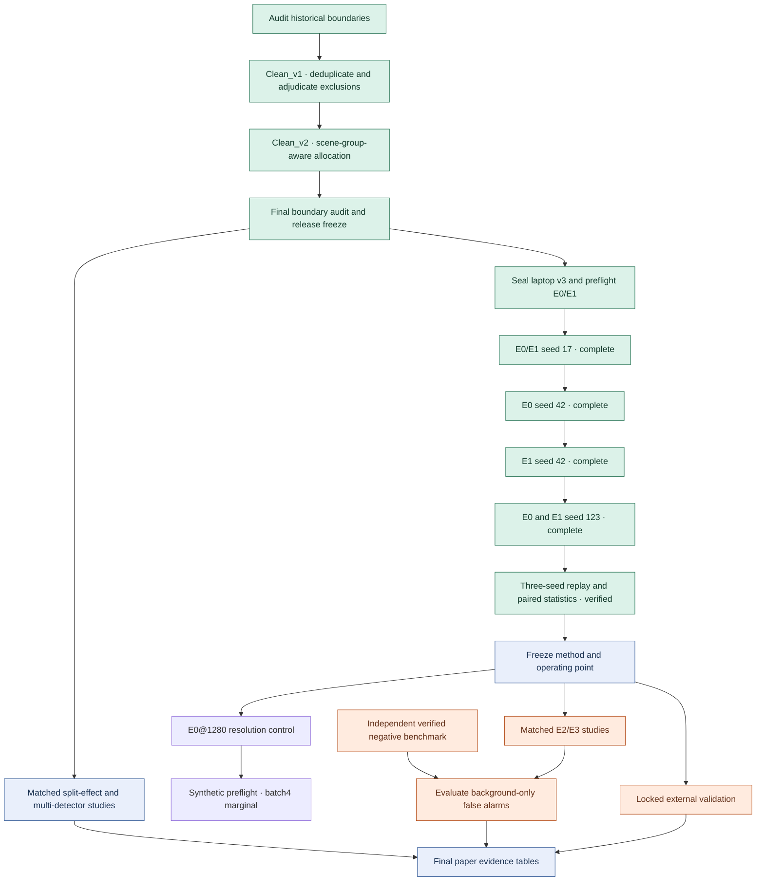
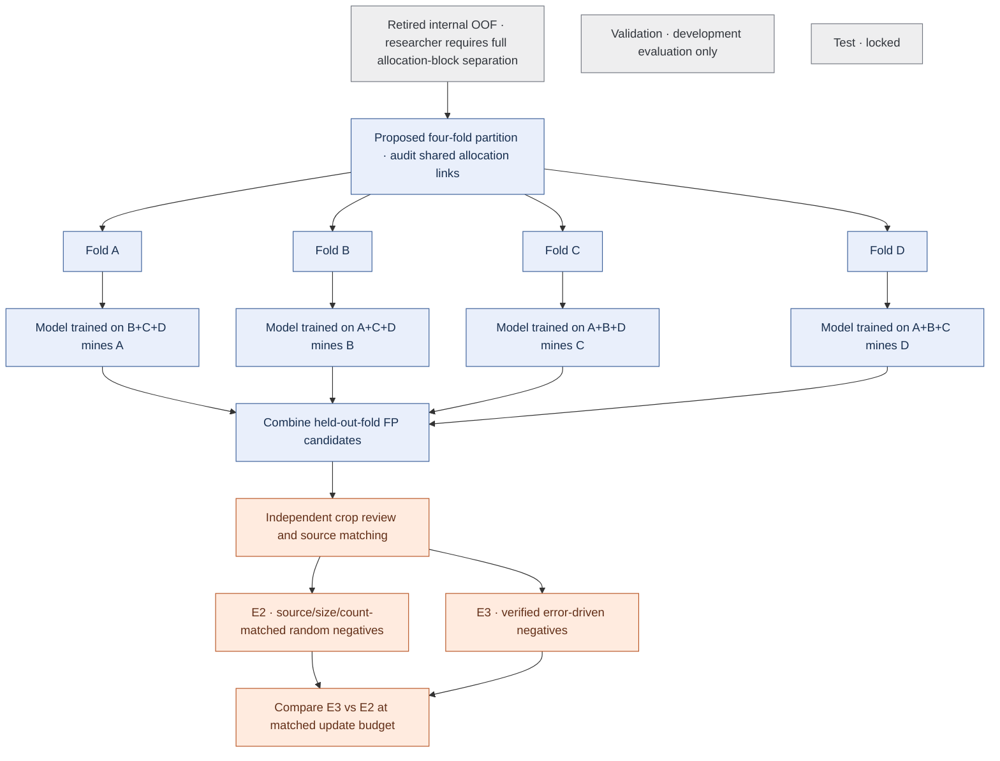
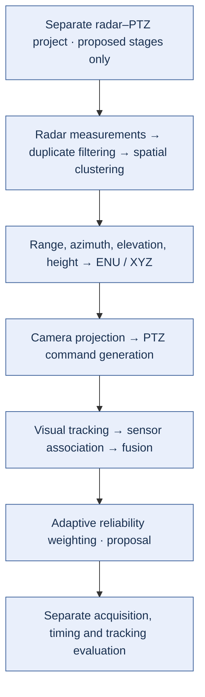
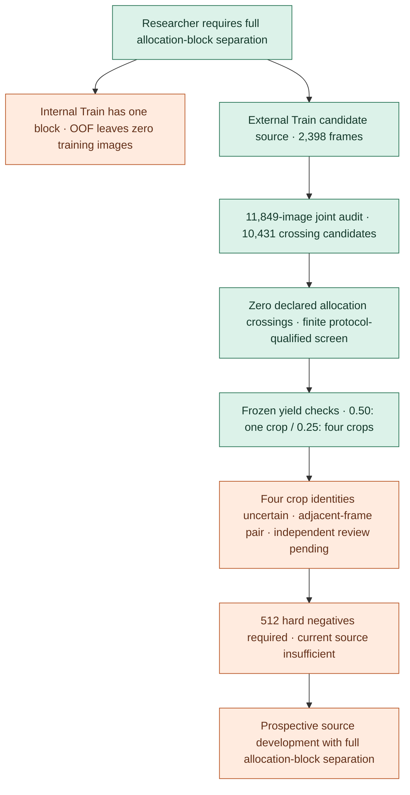

```mermaid
flowchart TB
    Paper["Visual research paper · leakage-aware small-UAV benchmarking"]
    Paper --> R1["RQ1 · Are historical scenes shared across splits?"]
    Paper --> R2["RQ2 · Does P2 improve Tiny recall?"]
    Paper --> R3["RQ3 · Does negative selection reduce false alarms?"]
    Paper --> R4["RQ4 · Do results generalize externally?"]
    Paper --> R5["RQ5 · Does reconstruction change detector rankings?"]
    R1 --> Audit["A · Exact duplicates and annotation audit"] --> Verify["DINOv2 → masked RootSIFT → RANSAC"] --> Release["Clean_v1 pool → Clean_v2 release"]
    Release --> Infl["A15 · Matched leakage-inflation study"]
    R1 --> R5 --> Families["F · Shared benchmark across detector families"]
    History["B · Historical YOLOv8 / YOLO26 pilots"] -. motivation .-> R2
    R2 --> Pair["C · E0 versus E1, paired by seed"]
    Pair --> P17["17 · pair complete"]
    Pair --> P42["42 · pair complete"]
    Pair --> P123["123 · pair complete"]
    R3 --> Neg["D · E2 random vs E3 error-driven"] --> Hold["Held-out verified negatives"]
    R4 --> Ext["E · Frozen visible sample and evaluator"] --> CI["Video-level uncertainty"]
    class Audit,Verify,Release,P17,P42,P123 complete
    class Infl,Families pending
    class History historic
    class Neg,Hold,Ext,CI blocked
    classDef complete fill:#dcf2e9,stroke:#257253,color:#14392b
    classDef pending fill:#e9effb,stroke:#3a5f99,color:#193050
    classDef blocked fill:#ffebdf,stroke:#b85524,color:#633019
    classDef historic fill:#eeeeef,stroke:#727780,color:#32363c
    classDef review fill:#fff4c8,stroke:#967412,color:#493900
```

```mermaid
flowchart LR
    Pool["9,999 images · historical snapshot"] --> V1["Clean_v1 · 9,451 retained"]
    V1 --> R["Whole-pool retrieval"]
    R --> Geo["Check target-masked background geometry"]
    Geo --> Groups["1,571 confirmed scene groups"]
    R --> Weak["Conservative similarity and low-texture constraints"]
    Groups --> Blocks["313 allocation blocks"]
    Weak --> Blocks
    Blocks --> Split["Reassign whole blocks"]
    Split --> Review["Fresh boundary review"]
    Review -->|Unresolved crossing| Repair["Preserve failed gate and repair allocation"]
    Repair --> Split
    Review -->|Final PASS| Freeze["Freeze Clean_v2 · 282,293 audited boundary pairs"]
    class Pool historic
    class V1,R,Geo,Groups,Blocks,Split,Review,Freeze complete
    class Weak,Repair review
    classDef complete fill:#dcf2e9,stroke:#257253,color:#14392b
    classDef pending fill:#e9effb,stroke:#3a5f99,color:#193050
    classDef blocked fill:#ffebdf,stroke:#b85524,color:#633019
    classDef historic fill:#eeeeef,stroke:#727780,color:#32363c
    classDef review fill:#fff4c8,stroke:#967412,color:#493900
```

```mermaid
flowchart TD
    Audit["Audit historical boundaries"] --> V1["Clean_v1 · deduplicate and adjudicate exclusions"]
    V1 --> V2["Clean_v2 · scene-group-aware allocation"]
    V2 --> Gate["Final boundary audit and release freeze"]
    Gate --> Lock["Seal laptop v3 and preflight E0/E1"]
    Lock --> Pair17["E0/E1 seed 17 · complete"]
    Pair17 --> Bas42["E0 seed 42 · complete"] --> Plus42["E1 seed 42 · complete"]
    Plus42 --> Both123["E0 and E1 seed 123 · complete"]
    Both123 --> Stats["Three-seed replay and paired statistics · verified"]
    Stats --> Freeze["Freeze method and operating point"]
    Freeze --> Rand["Matched E2/E3 studies"]
    Freeze --> Out["Locked external validation"]
    Freeze --> R1280["E0@1280 resolution control"]
    R1280 --> R1280pre["Synthetic preflight · batch4 marginal"]
    Nset["Independent verified negative benchmark"] --> Nscore["Evaluate background-only false alarms"]
    Rand --> Nscore
    Gate --> Matched["Matched split-effect and multi-detector studies"]
    Matched --> Tables["Final paper evidence tables"]
    Nscore --> Tables
    Out --> Tables
    class Audit,V1,V2,Gate,Lock,Pair17,Bas42,Plus42,Both123,Stats complete
    class Freeze,Matched,Tables pending
    class Rand,Out,Nset,Nscore blocked
    classDef complete fill:#dcf2e9,stroke:#257253,color:#14392b
    classDef pending fill:#e9effb,stroke:#3a5f99,color:#193050
    classDef blocked fill:#ffebdf,stroke:#b85524,color:#633019
    classDef historic fill:#eeeeef,stroke:#727780,color:#32363c
    classDef review fill:#fff4c8,stroke:#967412,color:#493900
```

```mermaid
flowchart TD
    T["Retired internal OOF · researcher requires full allocation-block separation"] --> F["Proposed four-fold partition · audit shared allocation links"]
    F --> A["Fold A"]
    F --> B["Fold B"]
    F --> C["Fold C"]
    F --> D["Fold D"]
    A --> MA["Model trained on B+C+D mines A"]
    B --> MB["Model trained on A+C+D mines B"]
    C --> MC["Model trained on A+B+D mines C"]
    D --> MD["Model trained on A+B+C mines D"]
    MA --> Pool["Combine held-out-fold FP candidates"]
    MB --> Pool
    MC --> Pool
    MD --> Pool
    Pool --> Verify["Independent crop review and source matching"]
    Verify --> E3["E3 · verified error-driven negatives"]
    Verify --> E2["E2 · source/size/count-matched random negatives"]
    E2 --> Compare["Compare E3 vs E2 at matched update budget"]
    E3 --> Compare
    Val["Validation · development evaluation only"]
    Test["Test · locked"]
    class T historic
    class F,MA,MB,MC,MD,A,B,C,D,Pool pending
    class Verify,E3,E2,Compare blocked
    class Val,Test historic
    classDef complete fill:#dcf2e9,stroke:#257253,color:#14392b
    classDef pending fill:#e9effb,stroke:#3a5f99,color:#193050
    classDef blocked fill:#ffebdf,stroke:#b85524,color:#633019
    classDef historic fill:#eeeeef,stroke:#727780,color:#32363c
    classDef review fill:#fff4c8,stroke:#967412,color:#493900
```

```mermaid
flowchart TB
    Project["Separate radar–PTZ project · proposed stages only"]
    Project --> Measure["Radar measurements → duplicate filtering → spatial clustering"]
    Measure --> Coord["Range, azimuth, elevation, height → ENU / XYZ"]
    Coord --> Camera["Camera projection → PTZ command generation"]
    Camera --> Tracking["Visual tracking → sensor association → fusion"]
    Tracking --> Reliability["Adaptive reliability weighting · proposal"]
    Reliability --> Eval["Separate acquisition, timing and tracking evaluation"]
    class Project,Measure,Coord,Camera,Tracking,Reliability,Eval pending
    classDef complete fill:#dcf2e9,stroke:#257253,color:#14392b
    classDef pending fill:#e9effb,stroke:#3a5f99,color:#193050
    classDef blocked fill:#ffebdf,stroke:#b85524,color:#633019
    classDef historic fill:#eeeeef,stroke:#727780,color:#32363c
    classDef review fill:#fff4c8,stroke:#967412,color:#493900
```

```mermaid
flowchart TD
    Requirement["Researcher requires full allocation-block separation"]
    Requirement --> Internal["Internal Train has one block · OOF leaves zero training images"]
    Requirement --> Source["External Train candidate source · 2,398 frames"]
    Source --> Boundary["11,849-image joint audit · 10,431 crossing candidates"]
    Boundary --> Screen["Zero declared allocation crossings · finite protocol-qualified screen"]
    Screen --> Yield["Frozen yield checks · 0.50: one crop / 0.25: four crops"]
    Yield --> Review["Four crop identities uncertain · adjacent-frame pair · independent review pending"]
    Review --> Shortfall["512 hard negatives required · current source insufficient"]
    Shortfall --> Next["Prospective source development with full allocation-block separation"]
    classDef completed fill:#dcf2e9,stroke:#257253,color:#14392b
    classDef blocked fill:#ffebdf,stroke:#b85524,color:#633019
    class Requirement,Source,Boundary,Screen,Yield completed
    class Internal,Review,Shortfall,Next blocked
```
